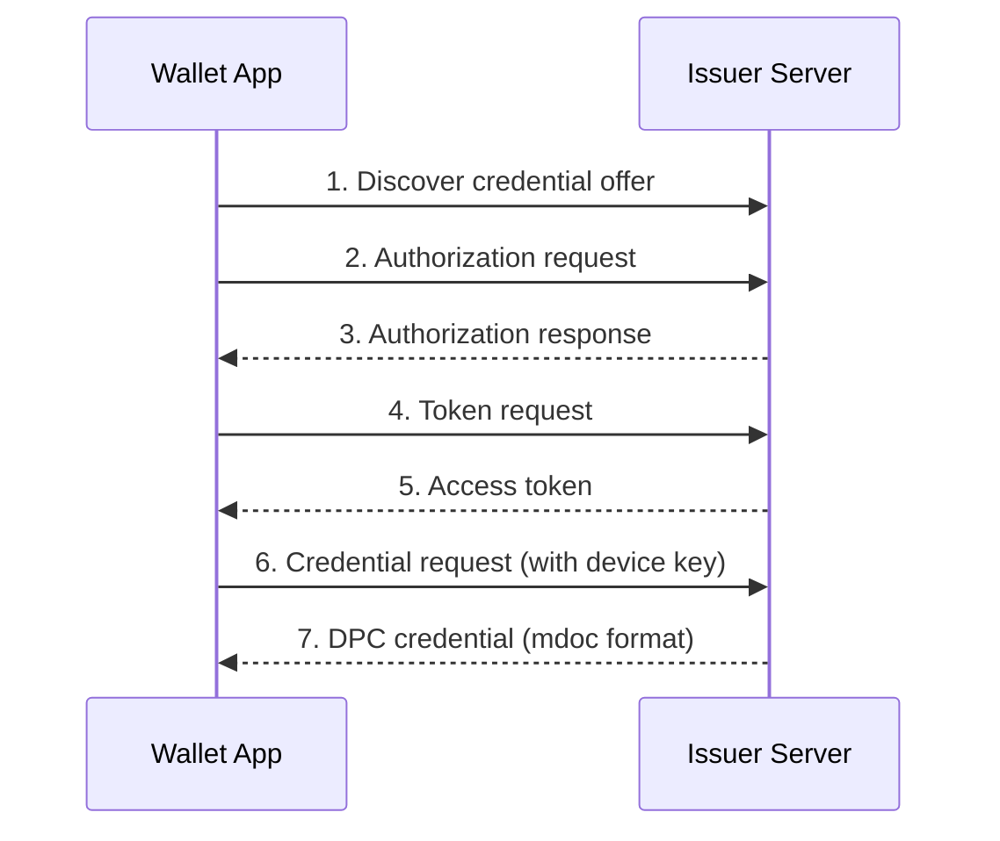

# Issuance

In this section you will learn how a Digital Payment Credential (DPC) is issued from the issuer server to the wallet. You will explore the credential structure, see how the issuer mints a DPC, and run the issuance flow end-to-end.

---

## Conceptual overview

Issuance is the first step in the DPC lifecycle. The issuer server creates a DPC credential containing payment-relevant attributes, binds it to the wallet's device key, and delivers it to the wallet via the **OpenID4VCI** protocol.

The wallet initiates the flow by requesting a credential offer. The issuer authenticates the request, generates the credential, and returns it to the wallet for secure storage.

### OpenID4VCI flow (high level)



The protocol details (endpoints, message payloads) are outside the scope of this codelab. For a deep dive into OpenID4VCI, refer to the [OpenID4VCI specification](https://openid.net/specs/openid-4-verifiable-credential-issuance-1_0.html).

---

## DPC credential structure

A DPC is an mdoc-format credential with document type `org.multipaz.payment.sca.1`. It contains six attributes in the `org.multipaz.payment.sca.1` namespace:

| Attribute | Type | Description | Example |
| --------- | ---- | ----------- | ------- |
| `issuer_name` | String | Human-readable name of the issuing institution | `Utopia Bank` |
| `payment_instrument_id` | String | Tokenized payment instrument identifier | `pi-77AABBCC` |
| `masked_account_reference` | String | Masked account reference (e.g., last 4 digits of PAN) | `****1234` |
| `holder_name` | String | Name of the payment account holder | `Erika Mustermann` |
| `issue_date` | Date | Date when the credential was issued | `2026-01-01` |
| `expiry_date` | Date | Date when the credential expires | `2031-01-01` |

These attributes are defined in the `DigitalPaymentCredential` document type:

```kotlin
// File: multipaz-doctypes/src/commonMain/kotlin/org/multipaz/documenttype/
//       knowntypes/DigitalPaymentCredential.kt

object DigitalPaymentCredential {
    const val CARD_DOCTYPE = "org.multipaz.payment.sca.1"
    const val CARD_NAMESPACE = "org.multipaz.payment.sca.1"

    fun getDocumentType(): DocumentType {
        return DocumentType.Builder("Payment Card Credential")
            .addMdocDocumentType(CARD_DOCTYPE)
            .addMdocAttribute(
                DocumentAttributeType.String,
                "issuer_name",
                "Issuer Name",
                "Human-readable issuer name.",
                true,
                CARD_NAMESPACE,
                Icon.ACCOUNT_BALANCE,
                "Utopia Bank".toDataItem()
            )
            // ... additional attributes follow the same pattern
            .build()
    }
}
```

---

## How the issuer mints a DPC

The issuer server uses `CredentialFactoryDigitalPaymentCredential` to create DPC credentials. The key method is `mint()`, which:

1. Reads the payment data from the credential request
2. Builds the issuer namespaces with all six DPC attributes
3. Creates a Mobile Security Object (MSO) with a 30-day validity window
4. Binds the credential to the wallet's device key
5. Signs everything with the issuer's signing key
6. Returns the base64url-encoded credential

```kotlin
// File: multipaz-openid4vci-server/src/main/java/org/multipaz/openid4vci/
//       credential/CredentialFactoryDigitalPaymentCredential.kt

internal class CredentialFactoryDigitalPaymentCredential : CredentialFactory {
    override val offerId: String get() = "payment_sca_mdoc"
    override val scope: String get() = "payment"
    override val name: String get() = "Digital Payment Credential (SCA)"

    override suspend fun mint(
        data: DataItem,
        authenticationKey: EcPublicKey?,
        credentialId: CredentialId
    ): MintedCredential {
        val now = Clock.System.now()
        val validFrom = now.truncateToWholeSeconds()
        val validUntil = validFrom + 30.days

        // Build namespace with all six DPC attributes
        val issuerNamespaces = buildIssuerNamespaces {
            addNamespace(DigitalPaymentCredential.CARD_NAMESPACE) {
                addDataElement("issuer_name",
                    paymentData.getValueOrDefault("issuer_name", "Utopia Bank"))
                addDataElement("payment_instrument_id",
                    paymentData.getValueOrDefault("payment_instrument_id", "pi-77AABBCC"))
                addDataElement("masked_account_reference",
                    paymentData.getValueOrDefault("masked_account_reference", "****1234"))
                addDataElement("holder_name", Tstr(holderName))
                addDataElement("issue_date", issueDate.toDataItemFullDate())
                addDataElement("expiry_date", expiryDate.toDataItemFullDate())
            }
        }

        // Create MSO with device-key binding
        val mso = MobileSecurityObject(
            version = "1.0",
            docType = DigitalPaymentCredential.CARD_DOCTYPE,
            signedAt = timeSigned,
            validFrom = validFrom,
            validUntil = validUntil,
            digestAlgorithm = Algorithm.SHA256,
            valueDigests = issuerNamespaces.getValueDigests(Algorithm.SHA256),
            deviceKey = authenticationKey!!,
            revocationStatus = revocationStatus
        )

        // Sign and return the credential
        return MintedCredential(
            credential = issuerProvidedAuthenticationData.toBase64Url(),
            creation = validFrom,
            expiration = validUntil
        )
    }
}
```

Key points to note:
- **Offer ID**: `payment_sca_mdoc` identifies this as a DPC credential offer
- **30-day validity**: The credential expires 30 days after issuance (`validFrom + 30.days`)
- **Device-key binding**: The `authenticationKey` parameter binds the credential to the wallet's device, preventing credential transfer to other devices
- **Revocation support**: Each credential gets a StatusList entry for future revocation

---

## Running the issuance flow

Follow these steps to observe DPC issuance end-to-end:

### Step 1: Start the issuer server

Navigate to the SDK repository root and start the issuer server:

```bash
./gradlew :multipaz-openid4vci-server:run
```

The server starts on `http://localhost:8080` by default.

### Step 2: Launch the testapp wallet

Open the `samples/testapp` project in Android Studio and run it on your device or emulator.

### Step 3: Request a DPC credential

In the testapp:
1. Navigate to the credential provisioning screen
2. Select the issuer server endpoint (`http://10.0.2.2:8080` if using an emulator, or your machine's local IP)
3. Choose the **Digital Payment Credential (SCA)** offer
4. Follow the authorization prompts

### Step 4: Verify the credential

Once issuance completes, the DPC should appear in the wallet's credential list. You can inspect it to see:
- The credential type (`org.multipaz.payment.sca.1`)
- All six DPC attributes with their values
- The validity period (30 days from issuance)
- The device-key binding status

<div style={{textAlign: 'center'}}>
  
  <p><em>The DPC credential displayed in the wallet's Document Store as "Ivan's Payment Card"</em></p>
</div>

In the next section, you will explore how the wallet stores and manages this credential internally.
